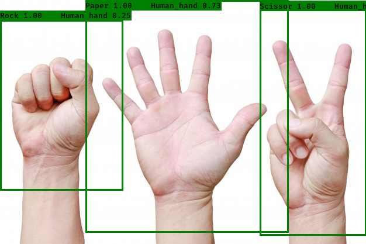

# Hand Gesture Recognition

## Pre-requisites:
- TensorFlow 1.15
- Keras 2.2.4
- Numpy (all versions should work)
- opencv-python (all versions should work)

__You can visit [Tensorflow website](https://www.tensorflow.org/install/gpu), for installation guide for above requisites.__

## About Model

- I have used tiny-YOLOv3 for Hands Detection and Localization because it is lightweight and has good accuracy.
- I have already retrained the model to detect Human Hands, you can find the keras model(`.h5`) in the [logs/000](logs/000) directory.
- After detecting the correct position of Hands in an Image using the tiny-YOLO, I cropped the image using these image coordinates.
- Then these cropped image is fed to another custom made model for Image Classification i.e. mobilenetV2.
- The mobilenetV2 works on top of the tiny-YOLOv3, which will categorize the image to either Rock, Paper, Scissors, or Alien. 
- You can find the retrained mobilenetV2 [here](https://drive.google.com/file/d/1pFAqWeeycO8m5AtxSfY-dXKnQW-BJ-I1/view?usp=sharing), download the file and place it in the `root`(current) directory, named as `RPS.h5`
- The script `yolo.py` works for detecting Hands Gestures on a WebCam
- If you want to change the default configurations, you can do so by changing the `_defaults` dictionary in the `yolo.py`, By default your Output will be a 416 x 416 pixels. You can change that by changing the defaults.
- If you want to detect Hands in an Image or a video, you can use `yolo_video.py`, it can take few arguments.
- To use the model on video you can run the command `python yolo_video.py --video path_to_video `
- You can also change the code in `yolo.py`, so that it only works for Hand Recognition and Localization. 
- If you would like to create a custom Recognition System. You can follow the [tutorial](https://github.com/pythonlessons/YOLOv3-object-detection-tutorial) here.

## Architecture for Custom mobilenetV2

